# How the temporal smoke model works

Pyronear cameras watch the horizon and capture a frame roughly every 30
seconds. A single-frame detector looking at one of those frames has a hard
problem: early wildfire smoke is a faint grey wisp a few pixels wide, easily
confused with clouds, fog banks, dust or sun glare. What distinguishes real
smoke is its **behavior over time** — it appears at a fixed point on the
terrain, grows, and drifts.

The temporal model exploits exactly that. Instead of judging one frame, it
judges a **sequence** of frames: a YOLO detector proposes candidate boxes per
frame, the boxes are linked across frames into *tubes* (one tube ≈ one
candidate plume tracked over time), and a ViT + transformer classifier scores
each tube's cropped image sequence as smoke / not smoke.

This document walks through the pipeline step by step. Tunable values
(thresholds, factors, frame counts) are referred to by their key in the
packaged `config.yaml` — every released `model.zip` carries its own copy,
which is the source of truth for that release. The worked-example figures
were generated with the v0.1.0 release.

## Why temporal? The hard case

This is what the model usually faces — a plume so small the full frame looks
empty (red box = YOLO detection, orange box = the crop window used by the
classifier):

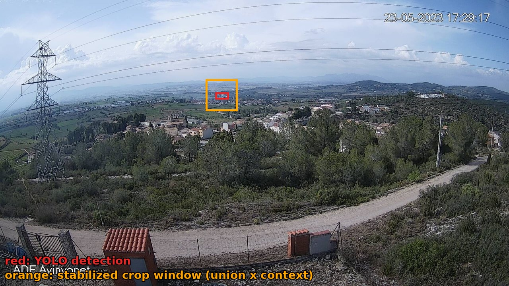

Cropped to the candidate region and laid out over time, the same sequence
becomes legible — the puff appears, thickens and drifts. That growth pattern
is the signal the temporal classifier learns:

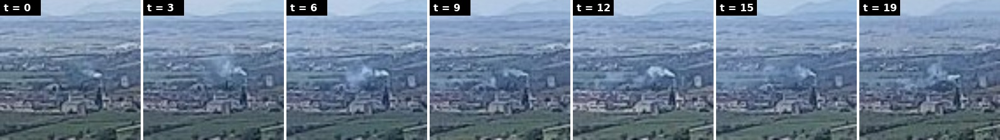

## Pipeline at a glance

`BboxTubeTemporalModel.predict()` ([core/src/temporal_model/core/model.py](../core/src/temporal_model/core/model.py))
runs six stages. Every stage is a pure function in
[core/src/temporal_model/core/inference.py](../core/src/temporal_model/core/inference.py),
so each one is unit-testable in isolation:

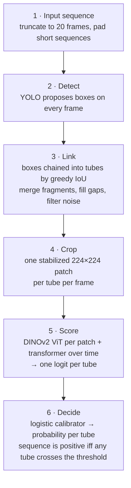

The rest of this document goes through each stage.

## Step 1 — Input: a sequence of frames

The model receives a temporally ordered list of frames (image paths, ~30 s
apart in production). Two adjustments happen before anything else
(`predict()`, "pad" stage):

- **Truncation** — at most `classifier.max_frames` frames are kept (the
  transformer head has a fixed number of positional slots — 20 in the shipped
  architecture).
- **Padding** — sequences shorter than `infer.pad_to_min_frames` are padded
  by duplicating real frames. The default `pad_strategy` is `symmetric`:
  prepend a copy of the first frame, append a copy of the last, alternating
  until the minimum length is reached
  (`pad_frames_symmetrically`). The padded slot indices are reported in the
  prediction details so downstream consumers can tell synthetic frames from
  real captures.

## Step 2 — Detect: YOLO proposes boxes per frame

A companion YOLO detector — bundled in the model package, its identity and
weight hash stamped in the manifest — runs once over all frames in a single
batched call (`run_yolo_on_frames`), with deliberately permissive settings:

| Parameter | Intent |
|---|---|
| `confidence_threshold` | kept low: recall over precision — the temporal classifier cleans up downstream |
| `iou_nms` | aggressive NMS — smoke boxes rarely overlap legitimately |
| `image_size` | high inference resolution — small distant plumes need pixels |

The output is a list of detections per frame, each a normalized
`(cx, cy, w, h)` box with a confidence. Here is a positive sequence with its
per-frame YOLO boxes — note how the box follows the plume as it grows:

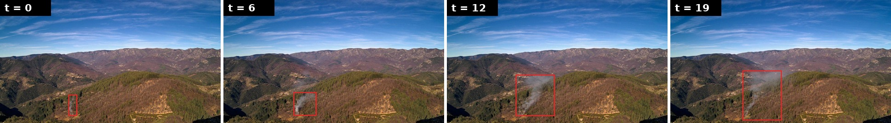

False positives are expected and tolerated at this stage. A cloud edge or dust
patch may well get a box; the next stages decide whether it *behaves* like
smoke.

## Step 3 — Link: detections become tubes

A **tube** is a chain of detections across consecutive frames that correspond
to the same spatial region — the bridge between per-frame boxes and the
classifier's need for a temporally ordered view of one candidate plume.

Tube building ([core/src/temporal_model/core/tubes.py](../core/src/temporal_model/core/tubes.py))
is greedy IoU tracking, frame by frame:

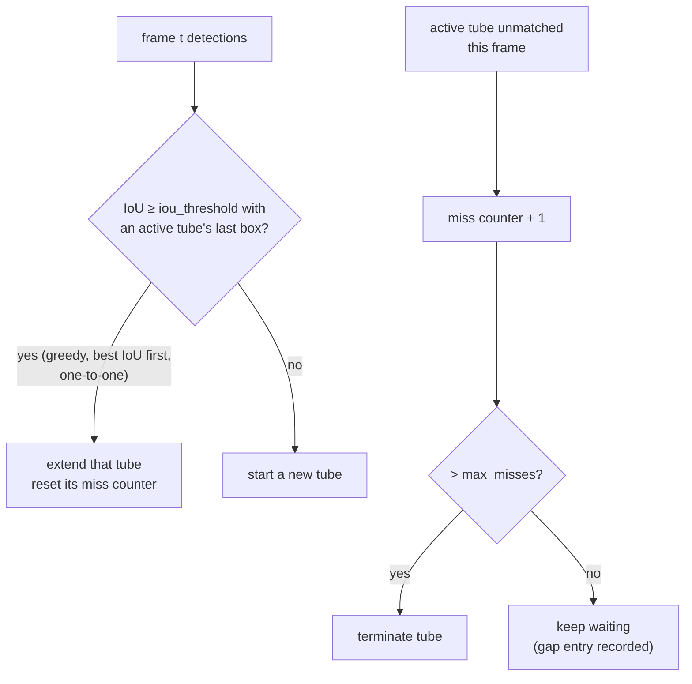

Raw tubes then go through three cleanup passes (`build_tubes_for_inference`):

1. **Filter** — drop tubes spanning fewer than `infer_min_tube_length`
   frames or with fewer than `min_detected_entries` real (non-gap)
   detections. One-frame flickers die here.
2. **Merge** — YOLO sometimes fragments one plume into several tubes (the box
   splits, drifts, or drops out and re-appears). Tubes that are temporally
   close (`merge_max_gap`) and spatially co-located (the smaller box mostly
   contained in the larger, `merge_iomin`, or their centers within roughly a
   box-size, `merge_prox_factor`) are fused into one tube
   (`merge_colocated_tubes`). On frames where fragments overlap, the
   largest-area box wins.
3. **Interpolate** — frames where the tracker missed the object (gap entries)
   get a synthetic box, linearly interpolated between the nearest observed
   boxes (`interpolate_gaps`). Gap entries are flagged `is_gap=True` and carry
   `confidence=0.0`.

Here are all three passes acting on a real sequence (run with the released
model; each row is a tube, each dot a detection on that frame):

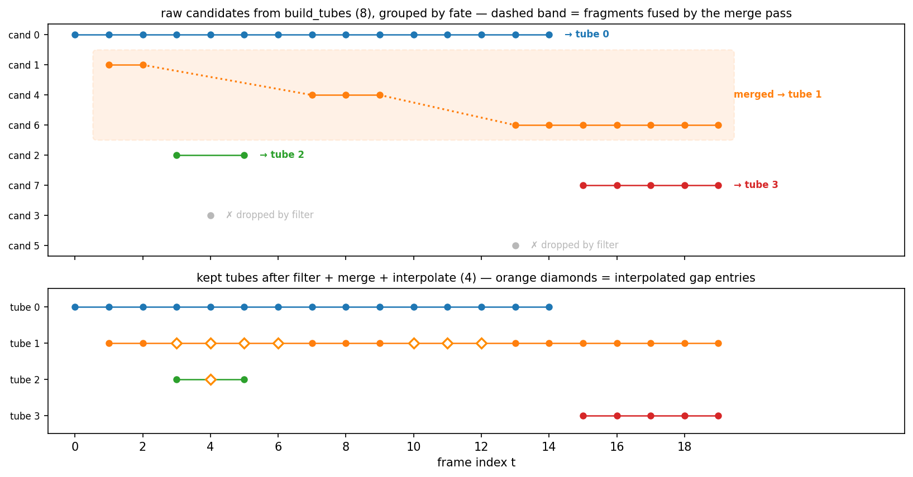

The tracker sees one plume as three orange fragments (`cand 1`, `cand 4`,
`cand 6`) — YOLO drops it twice, each time for longer than `max_misses`
tolerates. The merge pass recognizes the fragments as the same plume and
fuses them into a single tube spanning the whole sequence (`tube 1`); the
single-frame flickers (gray) never make it past the filter. Interpolation
then fills both dropouts with synthesized boxes (orange diamonds).

Here is what those entries look like as crops along the merged tube —
green border = observed detection, orange = interpolated box:

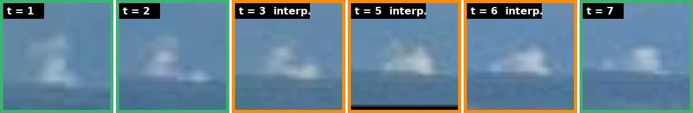

Note that the smoke never actually disappears — the detector simply dropped
it for a few frames (t = 3…6). The interpolated boxes keep cropping the same
spot, so the classifier's view of the plume stays continuous until YOLO
re-acquires it (t = 7). Without merge + interpolation this would have been
three short, weaker tubes.

And here is the same tube through the fixed stabilized window it will get in
the next step — spanning both dropouts, the horizon holds still while the
puff grows and drifts:

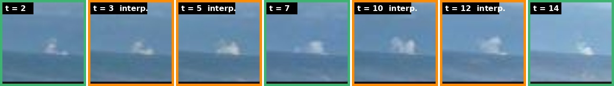

The result: a handful of clean, gap-free candidate tubes per sequence, each
saying "something box-shaped persisted *here* for *this* span of frames".

## Step 4 — Crop: one stabilized patch per tube per frame

For each tube, every frame is cropped to a square patch centred on the
candidate region (`crop_tube_patches`). The naive way to do this is to crop
each frame to its own YOLO box — and it looks like this:

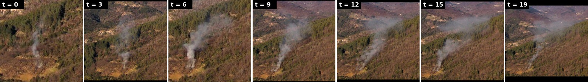

The detection box grows and shifts with the plume, so the framing re-zooms
and pans on every frame. The camera is bolted to a mast, yet the *background*
appears to move — most of the frame-to-frame change in these patches is
cropping artifact, not smoke. That is noise injected directly into the one
signal the temporal model is supposed to read: motion.

The pipeline therefore crops differently:

1. **Stabilize** — a single fixed **crop window** is used for the whole tube:
   the union of all its observed boxes (`tube_window` in
   [core/src/temporal_model/core/stabilize.py](../core/src/temporal_model/core/stabilize.py)).
   The background stays static across the patch sequence and the smoke is the
   only thing moving — exactly what a temporal model should attend to.
2. **Add context** — the window is expanded by `context_factor`, then
   squared off in pixel space (smoke is judged relative to its surroundings:
   horizon, terrain, nearby clouds).
3. **Resize + normalize** — the crop is resized to `patch_size` × `patch_size`
   (224 for the shipped ViT, bilinear) and normalized with ImageNet mean/std.

Red = per-frame YOLO detection, orange = the fixed stabilized window everyone
gets cropped to:

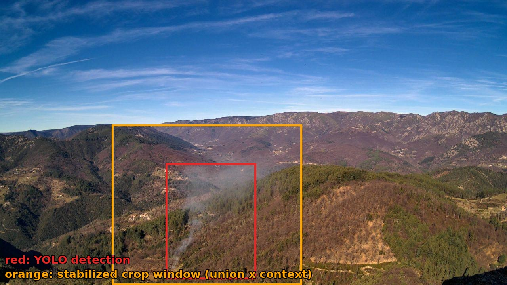

Same tube, same frames, stabilized — this is the actual classifier input. The
hillside now holds still, and the only thing left moving is the smoke:

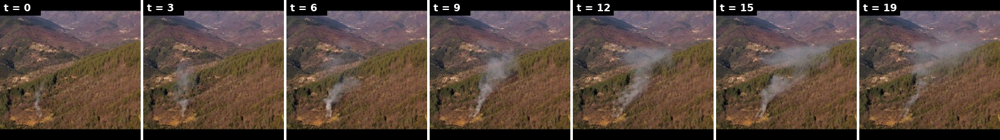

Patches for all of a tube's frames are stacked into a
`[max_frames, 3, patch_size, patch_size]` tensor plus a boolean mask marking
which slots hold a real patch.

## Step 5 — Score: ViT backbone + transformer head

The classifier ([core/src/temporal_model/core/temporal_classifier.py](../core/src/temporal_model/core/temporal_classifier.py))
separates *what is in each patch* from *how it evolves*:

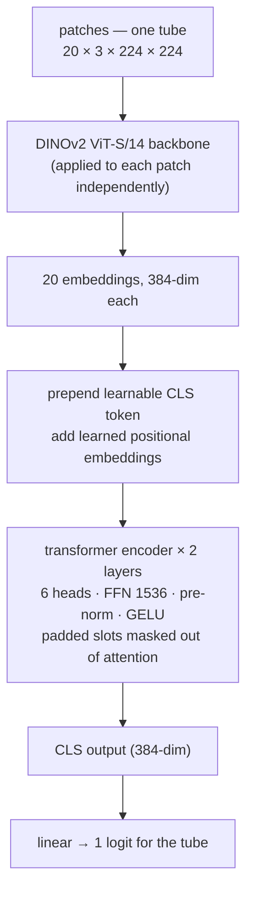

- **Spatial:** each patch goes through a DINOv2 ViT-S/14 backbone
  (`vit_small_patch14_dinov2.lvd142m` via timm), producing a 384-dim CLS
  embedding per frame. During training the backbone is frozen except its
  **last transformer block** (`finetune_last_n_blocks`) — enough to adapt
  DINOv2's general features to smoke textures without overfitting a small
  dataset.
- **Temporal:** the 20 per-frame embeddings get a learnable `[CLS]` token and
  learned positional embeddings, then pass through a 2-layer transformer
  encoder. Padded slots (short sequences, gap entries that stayed empty) are
  masked out of attention. A linear layer on the `[CLS]` output yields **one
  logit per tube**.

**Why a budget of exactly 20 slots?** The positional embeddings are *learned*
parameters (a `[max_frames + 1, 384]` table, +1 for `[CLS]`), not a sinusoidal
formula, so the maximum sequence length must be fixed when the model is
built. The value matches the data: the training dataset's sequences cap out
at 20 frames (median 19) — at the production cadence of one frame per ~30 s,
that is a ~10-minute window, the horizon within which early detection is
worth something. Longer inputs are truncated in Step 1; shorter ones occupy
fewer slots and the rest are masked out of attention. The number is inherited
from the original `vision-rd` experiments rather than an ablation recorded in
this repo — and it is not a compute constraint either: the per-frame ViT
forward dominates inference, so the temporal encoder's 21 tokens are nowhere
near a bottleneck.

### What the model actually receives

The figures below are computed with the released model on the tube from
Step 4. The backbone never sees the nice crops — it sees the ImageNet-
normalized float tensor, one patch at a time, with no temporal context
(shown clipped to ±2.5 σ for display):

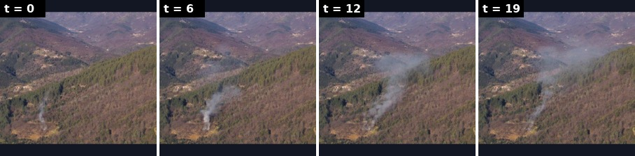

After the backbone, the whole tube has been reduced to 20 vectors of 384
floats — this matrix *is* the transformer head's input (plus the `[CLS]`
token and positional embeddings):

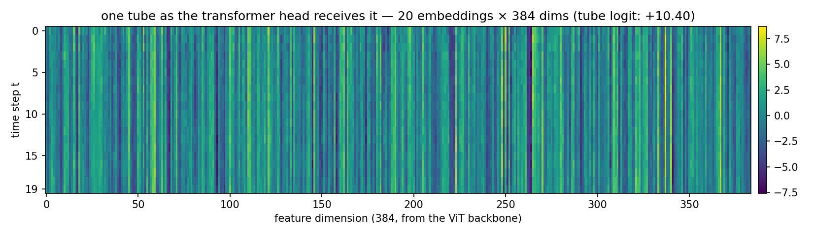

The vertical striping is the stabilization of Step 4 paying off: dimensions
encoding the static scene stay nearly constant down each column, so whatever
*varies* along the time axis is the plume. Attending over that, the head
scores this tube at logit **+10.4** — unambiguously smoke.

All tubes are scored in one batched forward pass (`score_tubes`).

## Step 6 — Decide: calibrated probability and the trigger

A raw logit is not a probability, and the logit alone ignores useful context
(a high logit on a 2-frame tube is weaker evidence than the same logit on a
15-frame tube). The released model uses the **logistic aggregation rule**: a
tiny logistic regression
([core/src/temporal_model/core/logistic_calibrator.py](../core/src/temporal_model/core/logistic_calibrator.py))
maps four features of each tube to a calibrated probability:

| Feature | Meaning | Effect on the probability |
|---|---|---|
| `logit` | the classifier's raw score | higher → more smoke-like |
| `log_len` | log(1 + tube length in frames) | longer tubes are trusted more |
| `mean_conf` | mean YOLO confidence over the tube | consistent detections are trusted more |
| `n_tubes` | number of kept tubes in the sequence | busy scenes are trusted less |

A tube is positive when its probability reaches `logistic_threshold`, which
is picked on the validation set at packaging time to hit the configured
`target_recall`. The calibrator ships inside
`model.zip` as plain JSON with fit-time sanity checks, and loading an
uncalibrated package is refused by default.

Here is the released calibrator (v0.1.0) at work. Left: the same raw logit
converts to very different probabilities depending on the tube behind it — a
long, consistently-detected, lone tube (green) crosses the decision
threshold at a far lower logit than a two-frame flicker in a busy scene
(red). Right: the resulting decision boundary over the logit × tube-length
plane — the longer the tube, the less the classifier's logit has to carry on
its own:

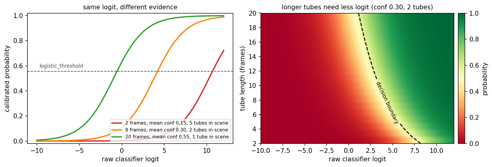

**The sequence is positive iff at least one tube is positive.**

### When would the alert have fired? (trigger search)

For evaluation, the model can also report the earliest frame at which the
decision would have crossed the threshold (`find_first_crossing_trigger`):
for each tube whose *full-length* decision is positive, prefixes of growing
length are re-scored until the decision first turns positive; the sequence's
`trigger_frame_index` is the earliest crossing over all such tubes. This gives
the **time-to-detection** metric (frames × 30 s = wall-clock delay).
Production skips this re-scoring loop (`compute_trigger=False`) and only
returns the verdict.

## The released package at a glance

`model.zip` is self-contained — everything `predict()` needs:

| File | Contents |
|---|---|
| `manifest.yaml` | format version, model version, provenance (training git SHA, detector identity + sha256) |
| `yolo_weights.pt` | companion YOLO detector weights |
| `classifier.ckpt` | `TemporalSmokeClassifier` weights (backbone + head) |
| `config.yaml` | every threshold and parameter named in this document |
| `logistic_calibrator.json` | calibrator coefficients + sanity checks |

Loading (`BboxTubeTemporalModel.from_package`) restores the exact training
configuration; there are no hidden defaults shared between training and
serving.

## Training, evaluation, serving

The monorepo packages map onto the lifecycle:

- **`train/`** — DVC pipeline: `truncate` (cap sequence length) →
  `build_tubes` (run YOLO + tube building offline over the dataset) →
  `build_model_input` (pre-crop the stabilized patches to disk; the
  `meta.json` files there were used to render the figures above) → `train`
  (Lightning, BCE on tube labels) → `package` (fit the calibrator, pick the
  decision threshold for the configured target recall, build `model.zip`).
- **`eval/`** — replays packaged models over held-out sequence datasets and
  reports protocol metrics (precision/recall, time-to-detection).
- **`api/`** — FastAPI service: `POST /predict` takes a list of S3 frame keys,
  downloads the images, runs `predict()`, and returns the verdict (verbose
  mode adds per-tube details: boxes, logits, probabilities). Per-frame YOLO
  detections are cached across calls, so a camera streaming overlapping
  sequences only pays detection cost for new frames.
- **`benchmark/`** — per-stage latency breakdown of `predict()` across
  machines.

## Where each step lives

| Step | Entry point | File |
|---|---|---|
| Orchestration | `BboxTubeTemporalModel.predict` | [core/.../model.py](../core/src/temporal_model/core/model.py) |
| 1 · Pad | `pad_frames_symmetrically` / `pad_frames_uniform` | [core/.../inference.py](../core/src/temporal_model/core/inference.py) |
| 2 · Detect | `run_yolo_on_frames` | [core/.../inference.py](../core/src/temporal_model/core/inference.py) |
| 3 · Link | `build_tubes`, `merge_colocated_tubes`, `interpolate_gaps` | [core/.../tubes.py](../core/src/temporal_model/core/tubes.py) |
| 4 · Crop | `crop_tube_patches`, `tube_window` | [core/.../inference.py](../core/src/temporal_model/core/inference.py), [core/.../stabilize.py](../core/src/temporal_model/core/stabilize.py) |
| 5 · Score | `TemporalSmokeClassifier`, `score_tubes` | [core/.../temporal_classifier.py](../core/src/temporal_model/core/temporal_classifier.py) |
| 6 · Decide | `make_decision_fn`, `LogisticCalibrator`, `find_first_crossing_trigger` | [core/.../inference.py](../core/src/temporal_model/core/inference.py), [core/.../logistic_calibrator.py](../core/src/temporal_model/core/logistic_calibrator.py) |
| Packaging | `build_model_package` / `load_model_package` | [core/.../package.py](../core/src/temporal_model/core/package.py) |

Design history and rationale for individual decisions live in
[docs/specs/](specs/).
